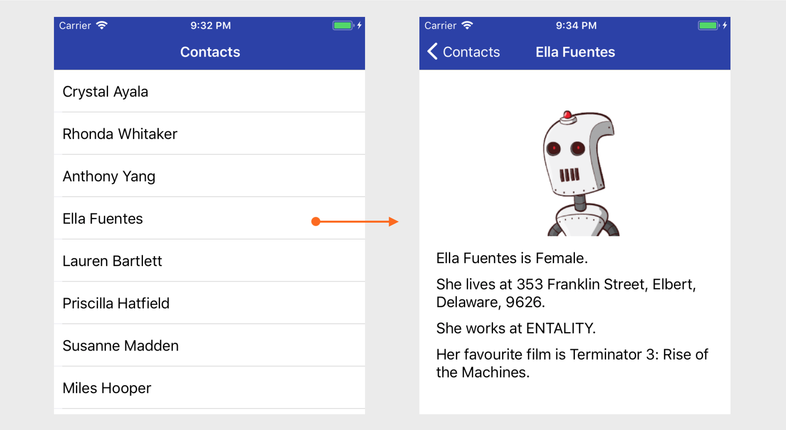
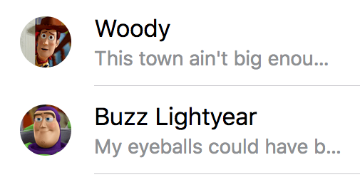

# List/Detail Pattern: Challenges

> Tip: start a new app with `create-react-native-app` to complete these challenges.

- Use React Navigation to create two screens: `List` and `Detail`. Add a button to navigate from list -> detail. Use the following configuration:
  - Give the List screen a headerbar title of 'Contacts'
  - Make sure the headerbar has a background colour of #2a3daa, with white text. If you are on iOS, don't forget the statusbar text colour too.
- Pull down the list of contacts from [here](assets/contacts.json) and put it into your project filesystem.
- Import the contacts and use FlatList to render each contact in the `List` screen. Each item should:
  - have a height of 50
  - display the contact name with size 18 font, padded from the left/right hand side of the screen by 10, and vertically centered inside the item
  - have a background colour of '#fff', changing to '#e4e4e4' when tapped
  - be separated from other items with a line of height 1, colour '#ddd' and marginLeft of 10.
- When an item is tapped in the `List`, navigate to the `Detail` screen, passing in the corresponding contact. Here, render the following, using the contact data:
  - The contact's name should be displayed in the headerbar.
  - The content below the headerbar should be horizontally padded by 20.
  - The contact's picture should be displayed in the main content area, below the headerbar. It should be 200x200 with a bottom margin of 10, and should be horizontally centered.
  - The contact's gender, address and company should be rendered below the picture. Each line should be of font size 18, and have a vertical margin of 5.
  - The contact's gender should be displayed in Title case, prefixed with _<name> is_. So, if _Joe Bloggs_ is male, this line should read _Joe Bloggs is Male._
  - The contact's address should be prefixed _He lives at_ or _She lives at_, depending on the contact's gender.
  - The contact's company should be prefixed _He works at_ or _She works at_, depending on the contact's gender.
  - The contact's favourite film should be prefixed _His favourite film is_ or _Her favourite film is_, depending on the contact's gender.

The final app should resemble the following:

## Extras

- Use the [react-native-image-progress](https://github.com/oblador/react-native-image-progress) module to show a loading spinner while the contact's image is loading.
- Modify the FlatList item to include the contact's avatar and company. The company should be displayed below the name, with a grey colour. The avatar should be to the left of them both, and should be enclosed in a circle. For example:

    

- Add a chevron to the right hand side of the list item, but only on iOS:
  - Use the [expo vector icons](https://docs.expo.io/versions/latest/guides/icons.html#expovector-icons) package, and search for the appropriate icon to use.
  - Ensure the icon is vertically centered inside the item, is coloured #ddd and has a size of 16.
- Add an icon to the headerbar of the Detail view. When the icon is tapped, open the [Expo WebBrowser](https://docs.expo.io/versions/latest/sdk/webbrowser.html) with the URL of the contact's favourite film. (Hint: use a `TouchableOpacity`, and check out the [React Navigation docs](https://reactnavigation.org/docs/header-buttons.html) for an example of headerbar buttons).